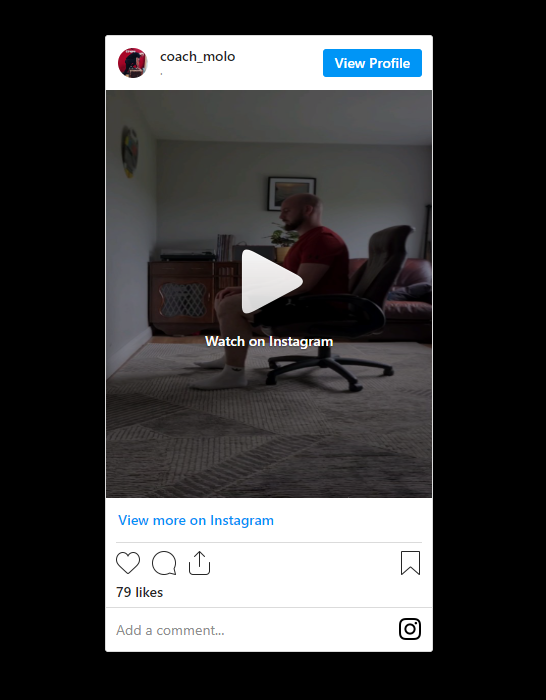
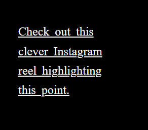
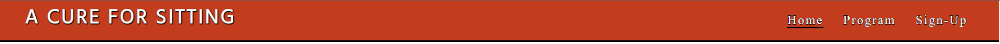
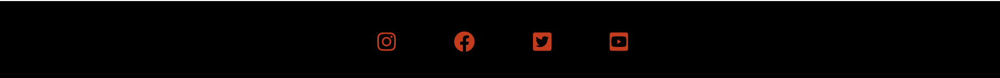
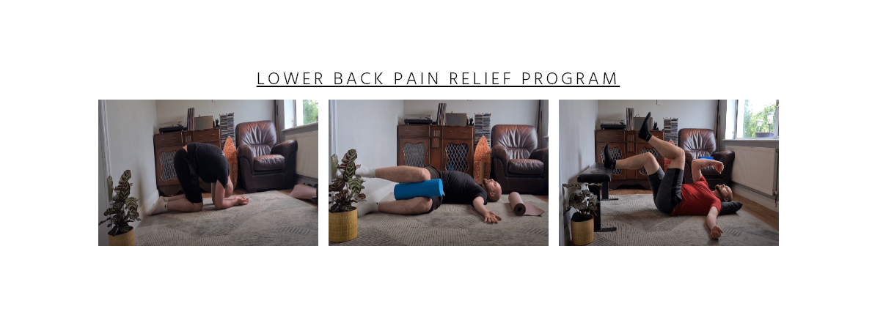
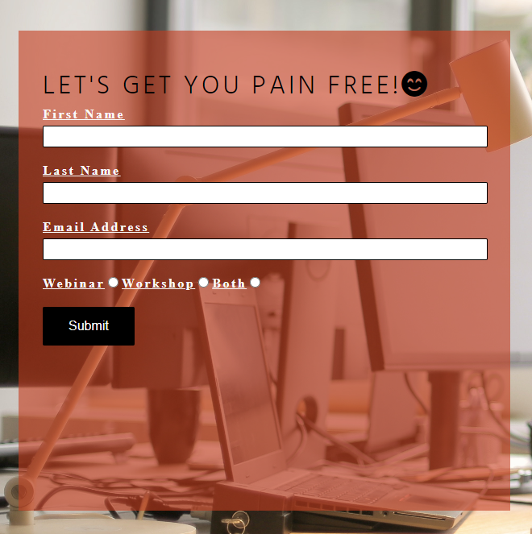

# Milestone Project 1- A Cure for Sitting
## Purpose
A cure for sitting is a project looking to educate software developers on ways to combat the negative physical effects of sitting for long periods of time. This site will be focused towards those who have tried the conventional interventions such as workplace ergonomics and passive physical modalities like cupping and dry needling and who are still suffering with aches and pains. The site is intended to be an intro to a new, proven method of pain relief through breath work and movement with the intent of future participation in a workplace wellness workshop or webinar. 

# User Experience Design
## Strategy
+ ### Design Strategy
  With an information heavy website designed to use education as an introduction to treatment, use of space around paragraphs would have to be used well to not overwhelm most users. Layout of accompanying images, videos and links would help break up the heavy reading experinece.
  The addition of practical elements is designed with the intent of giving the user a break from reading and a chance to try out the information just learnt.

+ ### Business Strategy
  The logo and name of the site "A Cure for Sitting" directly targets the user audience. As the user is guided down the page and start to implement the practical elements they will see the difference this approach to treating pain from long term sitting has versus traditional approaches. Its quicker, cheaper and less intrusive than other  modalities of treatment. The only drawback with this approach is it's not long lasting. That is where the program page comes in to offer an more robust treatment paln. If this is not enought then users are encouraged to sign up to a more intensive webinar or workshop to seek long lasting changes to physical health.

# Scope

+ The conception of this site was always easily implemtable. Through the use of established social medias from the site creator most of the practical content was readily available. 
+ Those suffering with back-pain generally go through the same channels of doctor referal to physio and templated exercises. The site was inteded to use education and a practical elements as a major source of adding value to the user to give acute relief to pain. 
+ The site was purposefully kept plane and clean in design to not distract the user from how easy it is to escape pain with the right methodology. 
+ The layout was designed to guide users through the home page first, trying out all the given methods. This would lead to a bigger commitment to a seperate program and so was put on a seperate page and kept even more simple.
+ All of this is planned to ultimately lead the user to sign-up to a future webinar or workshop with each section being a small step to buy-in towards this feature.

# Structure

  + The site is very simple and familiar to general webpage layout for ease of navigation. A consistent header and footer are used across all 3 pages with the smae font and color scheme for familiarity.
  + Content is kept visiable in all ratios to suit all devices from desktop to mobile screen. 
  + The addition of a sticky nav bar to take users to different internal sections of the home page will be included to reduce annoyance and also give them instant access to all three practical elements.
  + Any interactive aspects of the page such as navigation links and form input sections will change in color or appearence once interacted with to provide a secure user experience across the whole site.

  # Skeleton
  + Visualisation was the main structure behind the end layout and design of the site as it's quiet a simple and user-friendly approach by intent.
  + Value is established and built on throughout the whole layout of the home page.
  + A quick sketch with marker and plane paper was used to give a physical sense of the layout of the site for both desktop and mobile responsivness.
  
 

  # Surface
  + The finsihed product looks exaclty as conceptualised with only the instagram reel post image removed from the mobile screen responsive design to keep the site looking clean and simple when scrolling on a hand held device. This was replaced by adding an anchor element to the line of text directing towards the instagram post and decorating the text with an underline when the screen size is reduced below 620px in width.
 

# Features

## Home Page
+ ### Header. 

  This will introduce the general style of the site with the heading **A Cure For Sitting** and navigation links to the following features/sections.

### Sections
 The site main sections will be broken into three main parts directed towards educating and capturing the readers interest towards physical health when working in a seated position for long periods of time.

  + ### Intro
    The first section will be an intro paragraph focused on grabbing the users attention through shared experience and empathy. 
  
   

 + **The second section will be further divided into 3 main sections.**

    1.  ### Diaphragm
         A paragraph explaining the importance of breathing with an accompanying image and link to more information on the topic.

         The added image and external link will add value in breaking up the text and adding the first practical element to the user experience.

    2.  ### Spine
         This paragraph quickly explains the importance of moving your spine and layers on the value of the practical elements to this page. This is further expanded on with an emebedded youtube video.

    3.  ### Whole Body
        The final paragraph on the home page brings all the practical elements together and invites to user to get up and move. A link to an instagram post directed at conveying this message in a clever way is attatched and placed nicely next to this paragraph of text.

+ ### Outro
  The final main section will be an outro focused on nicely tidying up the concept of movement as a treatment for pain from sitting for long periods of time. thsi will end with a line of text guiding users to social media links in the footer.

+ ### Footer 
  A simple design in touch with the sites design with links to social medias.

  ## Navigation links
  will be placed across the top right hand side of the header to guide users to other pages on the website.

  + **Program**
        
    A page dedicated to the ading further value to ridding users of pain from long term sitting by giving them a program to follow and implement.

  + **Sign-up** 

    This page will give users the chance to enter their email, name and interest in either a webinar or workshop with more encouragment to reach out via social media links and email address. 
    A background image of someone sitting at a desk, upright and looking happy is added to convey the message of being healthy and pain free at a desk based job.

## Sticky Nav Bar
  A second nav bar with internal links to the text heavy sections of the home page for easier navigation.

# Features left to Implement
+ More programs to be added to the program page for different areas of the body. E.g. Shoulder pain. Sciatica like symptoms.

# Technologies

* HTML
	* This project uses HTML as the main language used to complete the structure of the Website.
* CSS
	* This project uses custom written CSS to style the Website.
* [Bootstrap](https://getbootstrap.com/)
	* The Bootstrap framework is used throughout this website for layouts and styling. The car
	* This has also been used to import JavaScript/Query used for the pop up Event booking modal
* [Font Awesome](https://fontawesome.com/)
	* Font awesome Icons are used for the Social media links contained in the Footer section of the website.
* [GitHub](https://github.com/)
	* GithHub is the hosting site used to store the source code for the Website and [Git Pages](https://pages.github.com/) is used for the deployment of the live site.
* [Git](https://git-scm.com/)
	* Git is used as version control software to commit and push code to the GitHub repository where the source code is stored.
* [TinyJPG](https://tinyjpg.com/)
	* TinyJPG is used to reduce the file sizes of images before being deployed to reduce storage and bandwith.
* [Google Chrome Developer Tools](https://developers.google.com/web/tools/chrome-devtools)
	* Google chromes built in developer tools are used to inspect page elements and help debug issues with the site layout and test different CSS styles.
* [Mocup Screenshot Generator](https://ui.dev/amiresponsive)
  * Mocup screenshot generator was used to create the responsivness image in this README.md file.
# Testing
+ The site was consistently launched with the python3 -m http.server command in the terminal of Github to check if the implemented code worked and to help see what it looked like in design and layout.
+ Prior to deployment the final code was rnn through  the [W3C HTML Validator](https://validator.w3.org/) and showed no errors. 
CSS Stylesheet was run through the [W3C CSS Validator](https://jigsaw.w3.org/css-validator/validator) and showed no errors also.
+ 
